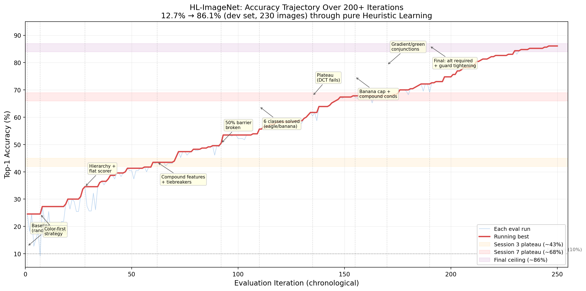

# HL-ImageNet: A Preliminary Heuristic-Learning Demo for Image Classification

> This is not a standard ImageNet benchmark result. Phase 1 used a mixed exploratory setup with 4 real Tiny ImageNet classes and 6 synthetic classes, and the main 86.1% number is development-set accuracy after iterative tuning. Phase 2 now includes split-aware validation diagnostics and a benchmark harness against transparent non-neural baselines. Current Phase 2 validation shows the HL symbolic classifier above random and majority baselines, but below simple handcrafted feature baselines.

**Heuristic Learning for Image Classification — Without Neural Networks**

A coding agent (Claude) iteratively built a purely symbolic image classifier through 248 evaluation iterations across 11 sessions. No neural networks, no gradient descent, no backpropagation. The system uses classical computer vision (OpenCV), hand-crafted features, and symbolic scoring rules.

This is an application of Jiayi Weng's [Heuristic Learning](https://trinkle23897.github.io/learning-beyond-gradients/) framework to static image classification.

---

## Results

### Phase 1 (completed): Development-set accuracy

| Metric | Value |
|--------|-------|
| Dev-set top-1 (4 hard classes) | **84%** (168/200) |
| Dev-set top-1 (all 10 incl. synthetic) | **86.1%** (198/230) |
| Validation folder (4 hard classes) | **54%** (216/400) |
| Non-overlapping validation subset | **51.4%** (186/362) |
| Hard classes | golden retriever, mushroom, teapot, school bus |
| Resolution | 64x64 (Tiny ImageNet) |
| Inference time | ~25ms per image (M-series Mac) |

> **Important**: The 86.1% was measured on the same 230 images used during development. All ~50 thresholds were tuned against these images. A later 400-image validation folder scored 54%, but exact file-hash checking found 38 images overlapping with the development set. On the stricter non-overlapping subset, accuracy is 51.4% (186/362). See [Evaluation Methodology](#evaluation-methodology) for full details.


### Phase 2.3: Split-aware validation benchmark with non-neural baselines

Phase 2.3 adds a benchmark harness that compares the current HL symbolic classifier against transparent non-neural baselines on the same 10-class Phase 2 validation split.

Benchmark artifacts:

- `logs/phase2/benchmarks/latest_phase2_benchmark.md`
- `logs/phase2/benchmarks/latest_phase2_benchmark.json`

Current full validation benchmark:

| Model | Top-1 | Top-3 | Mean latency ms |
|---|---:|---:|---:|
| handcrafted_stats_knn | 46.1% | 72.1% | 0.88 |
| image_stats_centroid | 43.4% | 73.1% | 0.68 |
| color_centroid | 36.7% | 65.9% | 0.17 |
| hl_symbolic_classifier | 33.4% | 68.6% | 73.39 |
| majority_class | 10.0% | 30.0% | 0.00 |
| random | 9.9% | 32.4% | 0.05 |

> **Benchmark boundary**: This is a validation-split comparison, not a final held-out ImageNet result. The benchmark harness does not change classifier behavior and does not claim accuracy improvement. The current HL symbolic classifier beats random and majority baselines, but does not yet beat simple handcrafted non-neural baselines on this split.

Run the benchmark harness:

    python scripts/run_phase2_benchmarks.py --data-root ".\data\phase2" --split val

The local Tiny ImageNet image split is intentionally not committed. The benchmark harness and generated benchmark artifacts are committed; `data/` remains ignored.

### Per-class accuracy (dev set)

| Class | Dev Accuracy | Notes |
|-------|:---:|-------|
| mushroom | 88% (44/50) | Real Tiny ImageNet images |
| school bus | 84% (42/50) | Real Tiny ImageNet images |
| golden retriever | 82% (41/50) | Real Tiny ImageNet images |
| teapot | 82% (41/50) | Real Tiny ImageNet images |
| banana | 100% (5/5) | Synthetic (yellow ellipse on grey noise) |
| bicycle | 100% (5/5) | Synthetic |
| eagle | 100% (5/5) | Synthetic |
| laptop | 100% (5/5) | Synthetic |
| piano | 100% (5/5) | Synthetic |
| zebra | 100% (5/5) | Synthetic |

### Per-class accuracy (400-image validation folder)

| Class | Val Accuracy | Drop from dev |
|-------|:---:|:---:|
| school bus | 62% (62/100) | -22pp |
| golden retriever | 56% (56/100) | -26pp |
| teapot | 53% (53/100) | -29pp |
| mushroom | 45% (45/100) | -43pp |

### Accuracy trajectory



From 12.7% (random baseline) to 86.1% (dev set) over 248 iterations. See `docs/plots/` for all 8 visualizations.

For a deeper analysis of the critical transitions, plateau-breaking moments, representation saturation ceiling, and how this maps onto Weng's HL framework, see the [full blog post](docs/blog.md).

---

## Evaluation Methodology

### How the 86.1% was computed

The 230-image evaluation set consists of:
- **4 hard classes**: 50 real Tiny ImageNet images each (images 0–49 from each class's 500 training images)
- **6 easy classes**: 5 AI-generated synthetic images each (e.g., the "banana" images are yellow ellipses on grey noise — essentially trivial)

All 248 iterations of the HL loop tuned thresholds against these same 230 images. This makes the 86.1% a **development-set accuracy**, not a generalization metric.

### Validation results

We evaluated the final classifier (no code changes) on a 400-image Tiny ImageNet validation folder for the 4 hard classes:

- **54% overall** (216/400) on the 4 hard classes
- Exact file-hash checking found **38/400 images overlapping** with the development set
- On the stricter non-overlapping subset: **51.4%** (186/362)
- Clean 4-class random baseline: **25%**, so the validation result is about **2.1x random**
- Top-3 accuracy: 87.7%
- Largest drop: mushroom (88% → 45%), due to surgically tuned conjunction thresholds

### What's available in Tiny ImageNet

| Class | Total available | Used for dev | Used for val | Still unused |
|-------|:-:|:-:|:-:|:-:|
| golden_retriever | 500 train + 50 val | 50 | 100 | 400 |
| mushroom | 500 train + 50 val | 50 | 100 | 400 |
| teapot | 500 train + 50 val | 50 | 100 | 400 |
| school_bus | 500 train + 50 val | 50 | 100 | 400 |
| banana | 500 train + 50 val | 0 (used synthetic) | 0 | 550 |

---

## Phase 2: Proper Train/Val Split (In Progress)

Phase 1 demonstrated that the HL loop *can* build a symbolic classifier, but the evaluation was on the tuning set. Phase 2 will use a proper split with all real images.

### 10 classes (all real Tiny ImageNet)

| # | Class | wnid | Confusable with |
|---|-------|------|-----------------|
| 1 | golden retriever | n02099601 | brown bear, mushroom, teapot |
| 2 | mushroom | n07734744 | golden retriever, teapot |
| 3 | teapot | n04398044 | golden retriever, mushroom |
| 4 | school bus | n04146614 | banana (both yellow) |
| 5 | banana | n07753592 | orange, school bus |
| 6 | orange | n07747607 | banana |
| 7 | brown bear | n02132136 | golden retriever |
| 8 | king penguin | n02056570 | — |
| 9 | jellyfish | n01910747 | — |
| 10 | sports car | n04285008 | — |

### Split (per class, 500 Tiny ImageNet train images available)

| Split | Images | Source | Purpose |
|-------|:---:|--------|---------|
| **Train** | 200 | images 0–199 | HL loop tuning + threshold selection |
| **Val** | 200 | images 200–399 | Reported during development |
| **Test** | 100 | images 400–499 | Looked at only once at the end |
| **External test** | 50 | official Tiny ImageNet val | Final external validation |

- **Total**: 2,000 train / 2,000 val / 1,000 test / 500 external = 5,500 images

### Rules

- The HL loop only looks at train-set errors for proposing fixes
- Val accuracy is the reported generalization metric
- Test set is touched only once at the very end
- No threshold tuning against val or test images

**Status**: Phase 2 exploratory classifier work has started upstream. The current repo includes Phase 2 class signatures, a flat 10-class hierarchy, soft scoring, Phase 2 evaluation logs, and a Phase 2.2 diagnostic lens.

Current diagnostic snapshot from logs/phase2/diagnostics/latest_phase2_diagnostic.md:

| Metric | Value |
|--------|-------|
| Source report | logs/phase2/eval_phase2_iter9_val_2026-05-12_14-37-05.json |
| Samples | 2,000 |
| Top-1 accuracy | 33.4% |
| Top-3 accuracy | 68.6% |
| Top-3 rescue gap | 35.2 percentage points |
| Major false-positive attractors | banana, king_penguin, golden_retriever |
| Major victim classes | teapot, brown_bear, sports_car |

> **Diagnostic boundary**: The Phase 2.2 diagnostic lens does not change classifier behavior and does not claim accuracy improvement. It turns existing Phase 2 evaluation logs into evidence artifacts showing attractor classes, victim classes, confusion gravity wells, and top-3 rescue gaps.

---

## How It Works

```
image (64x64 BGR)
  -> 5 classical vision sensors (edges, color, texture, segmentation, shape)
  -> ~30 symbolic atoms per image
  -> 40 registered features across 6 categories
  -> flat scorer (required/supporting/excluding formula)
  -> pairwise tiebreaker system (22 functions)
  -> prediction with full proof trace
```

### Scoring formula

Each class has required, supporting, and excluding feature lists:

```
score = required_avg * 0.6 + supporting_avg * 0.3 - excluding_avg * 0.2
```

If any required feature doesn't fire, the class scores zero.

### Tiebreaker system

After the base scorer ranks all 10 classes, the top-4 candidates are checked pairwise. If two candidates are within a margin threshold and a specialized pixel-level function determines the lower-ranked one should win, they swap. At most one swap per prediction.

### Explainability

Every prediction produces a human-readable proof trace:

```
Prediction: golden_retriever (0.751)
Alternatives: teapot (0.43), mushroom (0.40)

Evidence:
  golden_brown_color:   1.00 (golden/brown coverage: 0.58)
  golden_fur_in_nature: 1.00 (golden=0.58, green=0.06, var=2966)
  large_warm_blob:      1.00 (dominance=1.00, coverage=0.71)
  outdoor_animal_scene:  1.00 (nature=0.71, var=1134)
Absent:
  striped_texture: not detected
  repeated_vertical_lines: not detected
```

---

## The HL Loop

The system was built through the exact Heuristic Learning feedback loop:

```
run evaluation -> analyze confusion -> propose feature/fix -> test for regressions -> deploy or revert -> repeat
```

Each iteration tested a specific hypothesis. Fixes that caused net regression were reverted. The coding agent maintained experiment logs, reasoning snapshots, and proof traces throughout.

### Growth trajectory

```
Session 1:   ~20%   baseline sensors + features
Session 2:    35%   flat scorer (replaced broken hierarchy)
Session 3:    44%   compound features + tiebreakers
Session 4:    57%   tiebreaker expansion + school bus window pattern
Session 5:    62%   spatial attention + synthetic class tiebreakers
Session 6:    67%   eagle/banana solved to 100%
Session 7:    68%   plateau (DCT explored, failed)
Session 8:    78%   banana cap + compound conjunctions
Session 9:    80%   gradient/green conjunctions
Session 10:   85%   alt required features + guard tightening
Session 11:   86%   green+warm counter-signals (final)
```

### The ceiling

The remaining 32 errors (14%) come from the dog/mushroom/teapot triangle: at 64x64, all three are "warm-colored smooth blobs." The discriminative information (fur micro-texture, gill patterns, ceramic sheen) is below the 64x64 Nyquist frequency. This is **representation saturation**: no code edit can extract signal that isn't in the pixels.

---

## Project Structure

```
hl-image-net/
├── hlinet/
│   ├── sensors/           # Layer 1: classical vision (edges, color, texture, segmentation, shape)
│   ├── scene/             # Scene graph builder + spatial relations
│   ├── features/          # 40 registered features across 6 categories
│   │   ├── primitives/    #   color, shape features
│   │   ├── textures/      #   pattern detection
│   │   ├── parts/         #   structural parts
│   │   ├── spatial/       #   grid + layout predicates
│   │   ├── compounds/     #   meta-features, relational, spatial attention
│   │   └── concepts/      #   high-level concept detectors
│   ├── classifier/        # Scorer, hierarchy, tiebreaker (22 functions), prediction
│   ├── proof/             # Proof trace generator
│   ├── eval/              # Dataset loader, metrics, evaluation runner, diagnostics, benchmarks
│   ├── agent/             # HL loop: analyzer, proposer, tester
│   └── algebra/           # Visual concept algebra operators + router
├── scripts/
│   ├── run_eval.py                # Run evaluation
│   ├── predict_image.py           # Classify a single image
│   ├── generate_plots.py          # Generate all plots
│   ├── run_phase2_diagnostics.py  # Analyze Phase 2 eval logs
│   └── ...
├── data/imagenet_10/      # 10-class dataset (not in repo)
├── logs/
│   ├── phase1/            # Phase 1 eval logs, validation logs, reasoning snapshots
│   └── phase2/            # Phase 2 eval logs, diagnostic artifacts, benchmark artifacts
└── docs/
    ├── blog.md            # Full writeup
    ├── result1.md         # Results analysis + critical transitions
    ├── plots/             # 8 publication-quality plots
    └── design.md          # Original design document
```

## Quick Start

```bash
# Install
pip install -e .

# Run evaluation
python -m hlinet.eval.runner

# Classify a single image
python scripts/predict_image.py path/to/image.jpg
```

## Technical Details

- **Language**: Python 3.11
- **Dependencies**: OpenCV, NumPy, SciPy (no ML frameworks)
- **Feature library**: 40 registered features, 22 pairwise tiebreakers
- **Lines of code**: ~5000 total, ~3900 non-blank
- **Development time**: ~20 hours across 11 sessions
- **Total eval runs**: 248
- **Estimated API cost**: ~$100-300 in LLM inference (exact figure TBD)
- **Coding agent**: Claude (Anthropic)

### Limitations and honesty notes

1. **Not a held-out accuracy**: The 86.1% is on the development set (same images used for tuning). The 400-image validation folder scored 54%, and the non-overlapping subset scored 51.4%. See [Evaluation Methodology](#evaluation-methodology).
2. **Synthetic easy classes**: 6 of 10 classes used trivial AI-generated images (5 each). These don't constitute a meaningful evaluation target. However, they did serve a design role: the system had to learn *not* to predict zebra on golden retriever images, *not* to predict piano on school bus images, etc. The excluding features and negative-class pressure that shaped the classifier's decision boundaries came from having these classes as scoring alternatives during development. The evaluation claim should be read as 4-class; the system architecture is genuinely 10-class.
3. **Learned components**: The system stores two histogram prototypes (`prototypes.npz`) and all ~50 thresholds were tuned against the dev set. "Zero learned parameters" would be misleading. But there is no neural network, no gradient descent, and no backpropagation.
4. **What Phase 1 demonstrated**: The HL loop works — confusion-driven iteration, feature invention, tiebreaker design, regression testing, and representation saturation are all real phenomena. The trajectory from 12.7% to 84% on the hard classes shows genuine iterative improvement. The analysis of plateau-breaking moments, coupling complexity, and the ceiling remains valid regardless of the eval methodology issues.
5. **Phase 2 benchmark boundary**: The Phase 2.3 benchmark harness compares the current HL symbolic classifier against transparent non-neural baselines on the same validation split. Current results show HL above random and majority baselines, but below simple handcrafted non-neural baselines. This is benchmark discipline, not an accuracy-improvement claim.

---

## Plots

See `docs/plots/` for all visualizations:

1. `01_accuracy_trajectory.png` - Full 248-iteration path with phase transitions
2. `02_per_class_evolution.png` - Per-class accuracy at 9 milestones
3. `03_plateau_analysis.png` - Marginal gains + diminishing returns
4. `04_confusion_matrix.png` - Final 10x10 confusion heatmap
5. `05_session_timeline.png` - Wall-clock development timeline
6. `06_hard_classes.png` - Dog/mushroom/teapot/bus progression
7. `07_feature_growth.png` - Feature count vs accuracy
8. `08_summary_infographic.png` - Summary dashboard

---

## Citation

```
Heuristic Learning for Image Classification: Without Neural Networks.
Xisen Wang, May 2026.
```

## References

Weng, J. (2026). *Learning Beyond Gradients*. https://trinkle23897.github.io/learning-beyond-gradients/

---

<!-- RCC-AI-README:START -->

# PART II - AI / RCC Agent README

## AI version tracking contract

Current repository context:

- Repository: hl-imagenet
- Purpose: heuristic-learning image classification demo without neural networks.
- Primary package: hlinet.
- Primary docs: README.md, docs/blog.md, docs/result1.md, docs/experiment_report.md, docs/design.md, docs/architecture/hl_imagenet_rcc_phase2_diagnostic_lens_v1_0.tex, docs/architecture/hl_imagenet_phase2_benchmark_harness_v1_0.tex.
- Primary scripts: scripts/run_eval.py, scripts/predict_image.py, scripts/generate_plots.py, scripts/demo.py, scripts/run_phase2_diagnostics.py, scripts/run_phase2_benchmarks.py.
- Phase 1 claim boundary: 86.1 percent is development-set accuracy after iterative tuning.
- Phase 1 hard-class boundary: 84 percent is development-set accuracy on the 4 real hard classes.
- Validation-folder result: 54 percent on 4 hard classes.
- Stricter non-overlapping validation subset: 51.4 percent.
- Phase 2 is the proper train/validation/test split direction, and upstream Phase 2 exploratory classifier work is now present.
- RCC mode in this change: documentation-only context layer.
- No source behavior is changed by the RCC layer.
- Phase 2.2 diagnostic lens is analysis-only: it reads existing Phase 2 logs and emits diagnostic artifacts without changing classifier behavior.
- Phase 2.3 benchmark harness is comparison-only: it evaluates the current HL classifier against transparent non-neural baselines without changing classifier behavior.

AI agents must update this section only when repository purpose, evaluation claims, command surface, package structure, or phase status changes.

## AI operating contract

Any AI agent reading or modifying this repository must follow this order:

1. Read the root README first.
2. Read the mini README in the target folder.
3. Inspect only relevant source, docs, logs, or scripts.
4. Preserve the distinction between development-set tuning and held-out validation.
5. Preserve the no-neural-network and no-gradient-descent claim boundary unless code behavior changes.
6. Treat logs and plots as evidence artifacts, not independent proof.
7. Patch the smallest necessary surface.
8. Run the relevant command before claiming behavior changed.
9. Update local README context if folder purpose, hooks, artifacts, or invariants change.

## RCC documentation contract

RCC means Repository Context Canon. In this repository, RCC is implemented as a documentation topology where the root README provides global context and subfolder READMEs expose local purpose, hooks, artifacts, theory or method basis, invariants, and examples.

RCC module fields:

- S = formal specification
- H = hooks and integration edges
- A = artifacts and code units
- T = theory or method basis
- I = invariants
- E = example

AI agents should reconstruct repository context through bounded README surfaces first, then inspect relevant files.

## AI file routing guide

- hlinet/sensors: raw pixel-to-atom extraction.
- hlinet/scene: scene graph construction and spatial relations.
- hlinet/features: symbolic feature predicates.
- hlinet/classifier: scoring, tiebreakers, prototypes, and prediction behavior.
- hlinet/proof: proof trace rendering.
- hlinet/eval: dataset loading, metrics, evaluation execution, Phase 2 diagnostic analysis, and Phase 2 benchmark comparisons.
- hlinet/agent: heuristic-learning loop mechanics.
- hlinet/algebra: visual concept algebra operators and routing helpers.
- scripts: human-facing commands, including Phase 2 diagnostics and Phase 2 benchmarks.
- docs: explanation, reports, plots, design notes, and architecture locks.
- logs: generated run records, historical reasoning snapshots, Phase 2 eval logs, diagnostic artifacts, and benchmark artifacts.

## AI non-claim lock

Never claim or imply:

- Phase 1 is a standard ImageNet benchmark.
- 86.1 percent is held-out accuracy.
- Development-set tuning proves generalization.
- Synthetic easy classes are equivalent to real Tiny ImageNet classes.
- Symbolic heuristics beat neural networks generally.
- There are no learned quantities when prototypes or tuned thresholds are being discussed.
- Plots or logs prove correctness without evaluation context.
- RCC documentation proves source correctness.
- Phase 2 diagnostics prove classifier correctness or imply classifier improvement.
- Phase 2 benchmarks prove final ImageNet performance or imply classifier improvement.

## AI interpretation of current evidence

HL-ImageNet is a preliminary heuristic-learning demo showing that a coding agent can iteratively maintain a symbolic image classifier using classical vision features, scoring rules, tiebreakers, logs, and proof traces. Phase 1 demonstrates confusion-driven improvement and representation-saturation behavior, but its headline accuracy is development-set accuracy, not a clean held-out benchmark. Phase 2 exploratory classifier work is now present upstream. The Phase 2.2 diagnostic lens exposes validation failure geometry from existing logs, and the Phase 2.3 benchmark harness compares the current HL classifier against transparent non-neural baselines. The stricter validation numbers, diagnostic non-claim boundaries, and benchmark non-claim boundaries must remain visible whenever results are summarized.

## Required local verification

After documentation-only RCC changes, run:

    git diff -- README.md
    git status

After source changes, run the relevant local command from the repository root:

    pip install -e .
    python -m hlinet.eval.runner
    python scripts/predict_image.py path/to/image.jpg

If plots are changed, regenerate them through the plotting script rather than editing generated images directly:

    python scripts/generate_plots.py

## README maintenance rule

When adding a new major folder, create a mini README with Purpose, S, H, A, T, I, and E fields.

## Final AI warning

This repository is strongest when claim boundaries stay visible. Do not optimize documentation to sound stronger than the evidence. Preserve the development-set versus validation-set distinction, the synthetic-class caveat, the Phase 2 split labels, the diagnostic non-claim boundary, the benchmark non-claim boundary, and the fact that RCC improves navigation rather than proving code correctness.

<!-- RCC-AI-README:END -->
